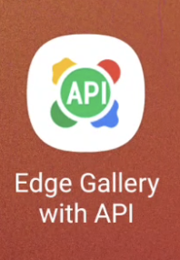
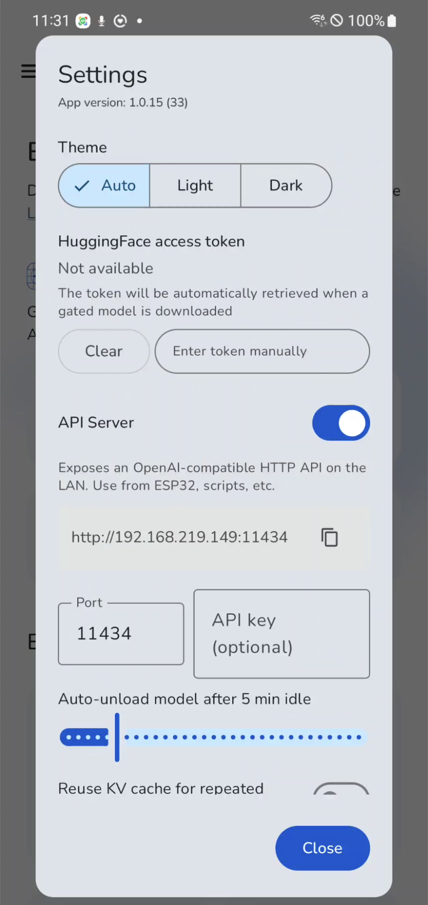
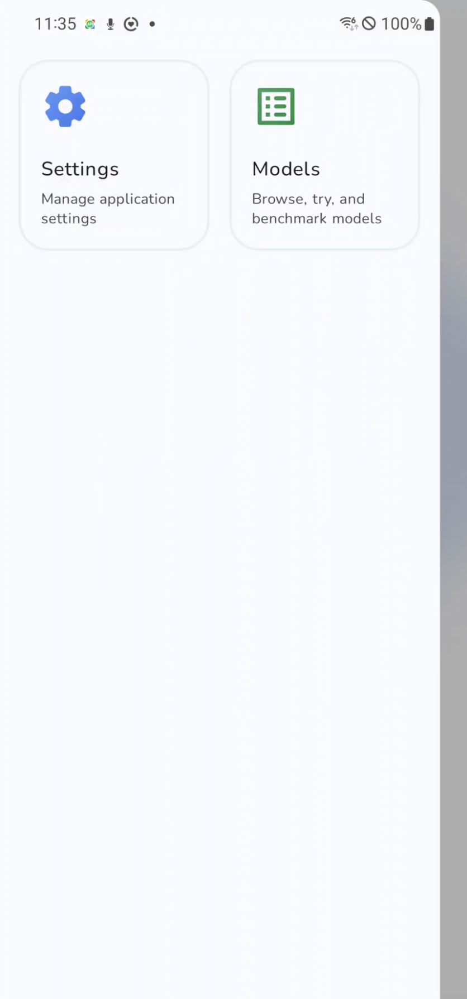
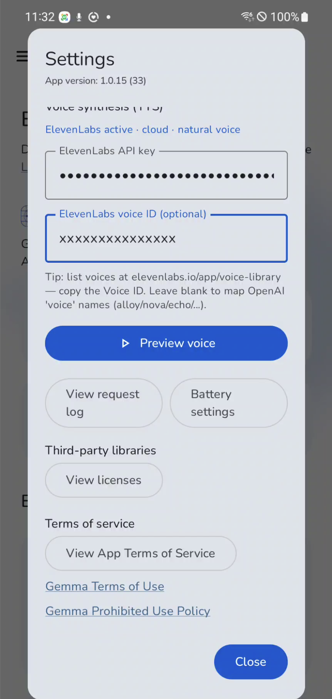

# Edge Gallery — with API Server

> 🆕 **What's new in this fork:** an [OpenAI-compatible HTTP API Server](#api-server--quick-start) has been added on top of the original Google AI Edge Gallery. Jump to [The Idea](#the-idea) · [Install](#install) · [Screenshots](#screenshots) · [Recommended Device Specs](#recommended-device-specs) · [Endpoints](#endpoints) · [Building from Source](#building-from-source).

> 📱 **Android-only fork.** This repository ships the Android sources only. The API server is written in Kotlin against Ktor + the Android JVM runtime, so **it does not build for iOS**. iPhone users should use the original [google-ai-edge/gallery](https://github.com/google-ai-edge/gallery), which has no API server but does ship an iOS app.

> **Repurpose your old smartphone as an LLM server.**
> A fork of [Google AI Edge Gallery](https://github.com/google-ai-edge/gallery) that adds an **OpenAI-compatible HTTP API** on top of the on-device inference engine, so any device on your LAN (laptop, ESP32, MicroPython board, another phone) can talk to your retired phone as if it were a self-hosted LLM endpoint.

[](LICENSE)

---

## The Idea

You probably have an old Android phone in a drawer with a perfectly good NPU and 8 GB of RAM. Instead of letting it gather dust, plug it into a charger and turn it into a **local LLM appliance**:

- **Run Gemma 4** (or any LiteRT-LM model) directly on the device — no cloud, no API keys, no rate limits.
- **Expose it as an OpenAI-compatible HTTP server** on your LAN. `POST /v1/chat/completions`, `POST /v1/audio/transcriptions`, `POST /v1/audio/speech`, `POST /v1/voice/chat` — drop-in replacements for OpenAI endpoints.
- **Talk to it from anything** — Python with the `openai` SDK, curl from your laptop, an ESP32 with `HTTPClient` + I2S DAC, a MicroPython board, your home automation.

The result: a fanless, low-power, fully offline inference server that lives next to your router.

---

## Screenshots

| Home (API server badge on app icon) | API Server toggled on |
| :--: | :--: |
|  |  |

| API Server settings | ElevenLabs TTS configuration |
| :--: | :--: |
|  |  |

---

## Recommended Device Specs

This fork is intentionally optimized for **old-but-still-capable** Android phones (2020 and newer flagships):

| | Minimum | Recommended |
| --- | --- | --- |
| **OS** | Android 12 (API 31) | Android 13+ |
| **CPU** | ARM64 (arm64-v8a) | ARM64 with dedicated NPU / DSP |
| **RAM** | 6 GB | **8 GB or more** (Gemma 4 E2B-IT loads ~1 GB, but headroom helps audio + KV cache) |
| **Free storage** | 4 GB | 16 GB+ (room for several quantized models) |
| **Network** | Wi-Fi (LAN access) | Wi-Fi 5+ on the same subnet as your clients |
| **Power** | USB charger | Plugged in 24/7 — disable battery optimization for the app |

In practice, devices in the class of **Galaxy S20 / Note 20 / Pixel 5 / OnePlus 8** and newer work well. Slow flash storage and < 8 GB RAM will result in slow cold starts, but inference itself stays usable.

> **Battery tip**: After enabling the API server, go to **Settings → Battery settings** inside the app and exclude it from battery optimization. Otherwise the OS will throttle the inference engine when the screen turns off.

---

## Install

Two paths — pick whichever fits you. **Most users should just grab the prebuilt APK; building from source is only needed if you want to modify the app.**

### Option 1 — Download the prebuilt APK (no build environment needed)

A signed APK is published on the [**Releases page**](https://github.com/ultra21c/edge-gallery-with-api/releases).

- 🔗 **Latest release**: https://github.com/ultra21c/edge-gallery-with-api/releases/latest
- 📦 **Direct APK download** (v1.0.15): https://github.com/ultra21c/edge-gallery-with-api/releases/download/v1.0.15/edge-gallery-with-api-v1.0.15.apk (~148 MB)

Install on a connected phone with adb:

```bash
adb install -r edge-gallery-with-api-v1.0.15.apk
```

…or transfer the APK to the phone, tap it in a file manager, and accept the "install from unknown source" prompt for that manager.

> The published APK is **signed with a debug keystore** — fine for personal use and sideloading, but you'll see Android's "untrusted source" warning the first time. It is not, and is not intended to be, distributable through Google Play.

### Option 2 — Build from source

If you want to modify the code or self-sign, follow the [Building from Source](#building-from-source) section below. This requires Android Studio (or JDK 17 + Android SDK) and a HuggingFace OAuth app.

---

## API Server — Quick Start

1. Install the APK — see the [Install](#install) section above.
2. Open the app → top-left hamburger menu → **Settings**.
3. Scroll to **API Server**, flip the toggle to **ON**.
4. The settings screen displays the URL — typically `http://<phone-ip>:11434`.
5. From any device on the same Wi-Fi:

   ```bash
   curl http://<phone-ip>:11434/health
   # → {"status":"ok","version":"1.0.15","uptime_seconds":12}
   ```

6. (Optional) Set an **API key** in Settings to require `X-API-Key: <key>` or `Authorization: Bearer <key>` on every `/v1/*` request. `/health` and `/status` always stay public for diagnostics.

---

## Endpoints

All `/v1/*` endpoints are OpenAI-compatible — the official `openai-python` and `openai` JavaScript SDKs work out of the box by pointing `base_url` at your phone.

| Method | Path | Purpose |
| --- | --- | --- |
| `GET`  | `/health`                    | Liveness probe (always public) |
| `GET`  | `/status`                    | Active model, memory usage, request counters |
| `GET`  | `/v1/models`                 | List models. Only `downloaded: true` entries are usable for inference |
| `POST` | `/v1/chat/completions`       | Chat — synchronous JSON or SSE streaming |
| `POST` | `/v1/audio/transcriptions`   | Speech-to-text (Whisper-compatible multipart) |
| `POST` | `/v1/audio/speech`           | Text-to-speech — WAV / PCM output for ESP32 I2S |
| `POST` | `/v1/voice/chat`             | **One-shot voice pipeline**: audio in → STT → LLM → TTS → audio out |

### Example — Chat Completions

```bash
curl http://<phone-ip>:11434/v1/chat/completions \
  -H "Content-Type: application/json" \
  -d '{
    "model": "gemma-4-e2b-it",
    "messages": [
      {"role": "system", "content": "You are a concise voice assistant."},
      {"role": "user",   "content": "What is the capital of South Korea?"}
    ],
    "stream": false
  }'
```

Streaming with `"stream": true` returns standard `text/event-stream` (`data: {...}\n\n ... data: [DONE]`) — the OpenAI SDKs parse it transparently.

### Example — Voice Pipeline (ESP32-friendly)

A single multipart request does the whole STT → LLM → TTS round trip and returns raw PCM ready for I2S:

```bash
curl http://<phone-ip>:11434/v1/voice/chat \
  -F file=@user-input.wav \
  -F system_prompt="Answer in one short sentence." \
  -F voice=alloy \
  -F response_format=pcm \
  --output response.pcm
```

Response headers include `X-Sample-Rate`, `X-Channels`, `X-Bits-Per-Sample`, `X-Transcript`, `X-Response-Text` plus per-stage timings (`X-Stt-Ms`, `X-Llm-Ms`, `X-Tts-Ms`). Wire the audio bytes straight into `i2s_write()`.

---

## Conversation Cache (KV reuse)

The LiteRT LM engine keeps a per-conversation KV cache. Send the same `X-Conversation-Id` header across requests and the prompt prefix is reused — subsequent turns are **5–10× faster** than cold starts.

| Scenario | First turn (cold) | Subsequent turn (warm) |
| --- | --- | --- |
| Stateless (no header) | ~10 s | ~10 s |
| Same `X-Conversation-Id` reused | ~10 s | **~1 s** |

The cache is **single-conversation-per-engine** — switching `X-Conversation-Id` resets the cache. Disable globally from Settings if you prefer fully stateless requests.

---

## TTS Backends — Android vs ElevenLabs

**How the backend is selected — automatic, key-driven:**

- 🔑 **If an ElevenLabs API key is set** in Settings → the server uses **ElevenLabs**. If a request fails (network down, quota exceeded, etc.), it falls back to Android TTS automatically.
- 🤖 **If no ElevenLabs key is set** → the server uses the built-in **Android TTS** engine (fully offline, no extra setup).

The response header `X-Tts-Backend` (`ElevenLabs` or `Android TTS`) tells you exactly which backend produced the audio for every individual request.

| | Android TTS (default) | ElevenLabs |
| --- | --- | --- |
| Quality | Robotic | Human-like |
| Latency | 170–650 ms | ~3000 ms (network) |
| Internet | Not required | Required |
| Cost | Free | Free tier 10 K char/month, then paid |
| Setup | None | Paste API key in Settings |

Voice naming follows OpenAI conventions (`alloy`, `echo`, `fable`, `onyx`, `nova`, `shimmer`) and maps to Android locale voices or ElevenLabs voice IDs. Pasting a 20-character ElevenLabs voice ID in the `voice` field bypasses the mapping.

---

## Automatic Markdown Stripping

LLMs love to emit `**bold**`, headings, numbered lists, and `[links](url)`. These read poorly when fed straight into a TTS engine. The API automatically strips markdown formatting **on the TTS path only** before synthesis:

| LLM output | Spoken text |
| --- | --- |
| `The capital is **Seoul**.` | "The capital is Seoul." |
| `1. First\n2. Second`       | "First. Second." |
| `` `code` snippet ``         | "code snippet" |

Text responses from `/v1/chat/completions` are **unchanged** — the markdown survives so your chat UI can still render it. Only TTS sees the cleaned version.

---

## Building from Source

> **You probably don't need this section.** If you only want to *use* the app, grab the prebuilt APK from the [Install](#install) section above — it's the same binary, just published as a release asset. This section is for people who want to modify the code, sign with their own key, or build off a different branch.

### Prerequisites

> **Platform:** Android only. There is no iOS / Xcode project in this repository — the API server depends on Ktor + Android APIs that have no iOS equivalent.

- **Android Studio** (latest stable) or just **JDK 17 + Android SDK + command-line gradle**
- **HuggingFace OAuth app** — required for the in-app model downloader. Create one at [HuggingFace OAuth docs](https://huggingface.co/docs/hub/oauth#creating-an-oauth-app).

### One-time configuration

1. In [`Android/src/app/src/main/java/com/google/ai/edge/gallery/common/ProjectConfig.kt`](Android/src/app/src/main/java/com/google/ai/edge/gallery/common/ProjectConfig.kt), replace the placeholders for `clientId` and `redirectUri` with values from your HuggingFace OAuth app.
2. In [`Android/src/app/build.gradle.kts`](Android/src/app/build.gradle.kts), set `manifestPlaceholders["appAuthRedirectScheme"]` to match the redirect scheme you registered with HuggingFace.

### Build the APK

From the repository root:

```bash
cd Android/src
./gradlew :app:assembleRelease
```

The output APK lands at:

```
Android/src/app/build/outputs/apk/release/app-release.apk
```

The default `release` variant is signed with the debug keystore, which is fine for sideloading but **not** for Google Play distribution. Configure your own `signingConfig` in `Android/src/app/build.gradle.kts` if you plan to ship to Play.

### Install on a connected device

```bash
adb install -r Android/src/app/build/outputs/apk/release/app-release.apk
```

---

## How It Differs From Upstream

This fork adds, on top of vanilla [google-ai-edge/gallery](https://github.com/google-ai-edge/gallery):

- `apiserver/` package — an embedded HTTP server (Ktor / NanoHTTPD-style) wired into the inference coordinator.
- OpenAI-compatible request/response schemas (`OpenAiSchemas.kt`).
- KV-cache reuse keyed by `X-Conversation-Id`.
- Dual TTS backend (`AndroidTtsBackend`, `ElevenLabsTtsBackend`) selectable from Settings.
- Markdown stripping in the TTS path (`TextNormalizer.kt`).
- Settings UI (`ApiServerSection.kt`, `ApiServerViewModel.kt`) for toggling the server, API key, port, idle timeout, and TTS configuration.

Everything else — model management, on-device chat UI, Ask Image, Audio Scribe, Prompt Lab, benchmarks — is unchanged from upstream.

---

# Google AI Edge Gallery ✨

[](LICENSE)
[](https://github.com/google-ai-edge/gallery/releases)

**Explore, Experience, and Evaluate the Future of On-Device Generative AI with Google AI Edge.**

AI Edge Gallery is the premier destination for running the world's most powerful open-source Large Language Models (LLMs) on your mobile device. Experience high-performance Generative AI directly on your hardware—fully offline, private, and lightning-fast.

**Now Featuring: Gemma 4**

The latest version brings official support for the newly released Gemma 4 family. As the centerpiece of this release, Gemma 4 allows you to test the cutting edge of on-device AI. Experience advanced reasoning, logic, and creative capabilities without ever sending your data to a server.


| **Install the app today from Google Play** | **Install the app today from App Store** |
| :--- | :--- |
| <a href='https://play.google.com/store/apps/details?id=com.google.ai.edge.gallery'></a> | <a href="https://apps.apple.com/us/app/google-ai-edge-gallery/id6749645337?itscg=30200&itsct=apps_box_badge&mttnsubad=6749645337" style="display: inline-block;"> </a> |

For users without Google Play access, install the apk from the [**latest release**](https://github.com/google-ai-edge/gallery/releases/latest/)


## App Preview


## ✨ Core Features

* **Agent Skills**: Transform your LLM from a conversationalist into a proactive assistant. Use the Agent Skills tile to augment model capabilities with tools like Wikipedia for fact-grounding, interactive maps, and rich visual summary cards. You can even load modular skills from a URL or browse community contributions on GitHub Discussions.

* **AI Chat with Thinking Mode**: Engage in fluid, multi-turn conversations and toggle the new Thinking Mode to peek "under the hood." This feature allows you to see the model’s step-by-step reasoning process, which is perfect for understanding complex problem-solving. Note: Thinking Mode currently works with supported models, starting with the Gemma 4 family.

* **Ask Image**: Use multimodal power to identify objects, solve visual puzzles, or get detailed descriptions using your device’s camera or photo gallery.

* **Audio Scribe**: Transcribe and translate voice recordings into text in real-time using high-efficiency on-device language models.

* **Prompt Lab**: A dedicated workspace to test different prompts and single-turn use cases with granular control over model parameters like temperature and top-k.

* **Mobile Actions**: Unlock offline device controls and automated tasks powered entirely by a finetune of FunctionGemma 270m.

* **Tiny Garden**: A fun, experimental mini-game that uses natural language to plant and harvest a virtual garden using a finetune of FunctionGemma 270m.

* **Model Management & Benchmark**: Gallery is a flexible sandbox for a wide variety of open-source models. Easily download models from the list or load your own custom models. Manage your model library effortlessly and run benchmark tests to understand exactly how each model performs on your specific hardware.

* **100% On-Device Privacy**: All model inferences happen directly on your device hardware. No internet is required, ensuring total privacy for your prompts, images, and sensitive data.

## 🏁 Get Started in Minutes!

1. **Check OS Requirement**: Android 12 and up, and iOS 17 and up.
2.  **Download the App:**
    - Install the app from [Google Play](https://play.google.com/store/apps/details?id=com.google.ai.edge.gallery) or [App Store](https://apps.apple.com/us/app/google-ai-edge-gallery/id6749645337).
    - For users without Google Play access: install the apk from the [**latest release**](https://github.com/google-ai-edge/gallery/releases/latest/)
3.  **Install & Explore:** For detailed installation instructions (including for corporate devices) and a full user guide, head over to our [**Project Wiki**](https://github.com/google-ai-edge/gallery/wiki)!

## 🛠️ Technology Highlights

*   **Google AI Edge:** Core APIs and tools for on-device ML.
*   **LiteRT:** Lightweight runtime for optimized model execution.
*   **Hugging Face Integration:** For model discovery and download.

## ⌨️ Development

Check out the [development notes](DEVELOPMENT.md) for instructions about how to build the app locally.

## 🤝 Feedback

This is an **experimental Beta release**, and your input is crucial!

*   🐞 **Found a bug?** [Report it here!](https://github.com/google-ai-edge/gallery/issues/new?assignees=&labels=bug&template=bug_report.md&title=%5BBUG%5D)
*   💡 **Have an idea?** [Suggest a feature!](https://github.com/google-ai-edge/gallery/issues/new?assignees=&labels=enhancement&template=feature_request.md&title=%5BFEATURE%5D)

## 📄 License

Licensed under the Apache License, Version 2.0. See the [LICENSE](LICENSE) file for details.

## 🔗 Useful Links

*   [**Project Wiki (Detailed Guides)**](https://github.com/google-ai-edge/gallery/wiki)
*   [Hugging Face LiteRT Community](https://huggingface.co/litert-community)
*   [LiteRT-LM](https://github.com/google-ai-edge/LiteRT-LM)
*   [Google AI Edge Documentation](https://ai.google.dev/edge)
